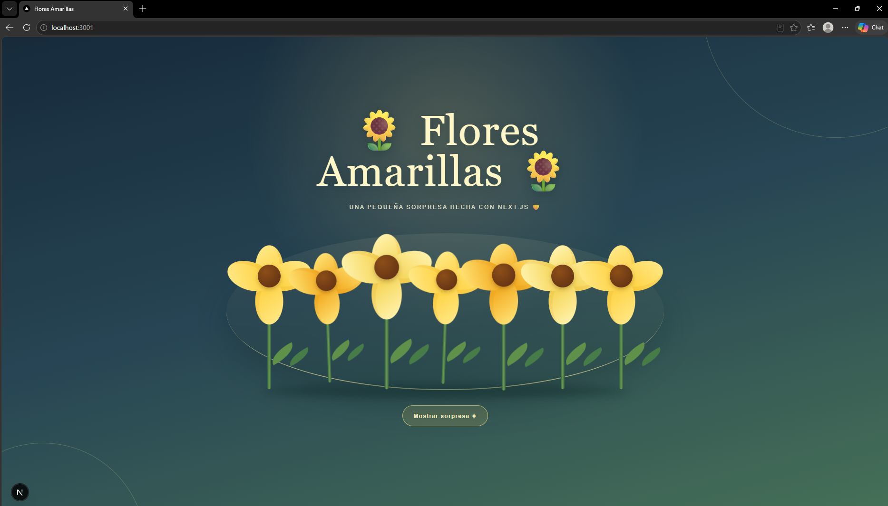
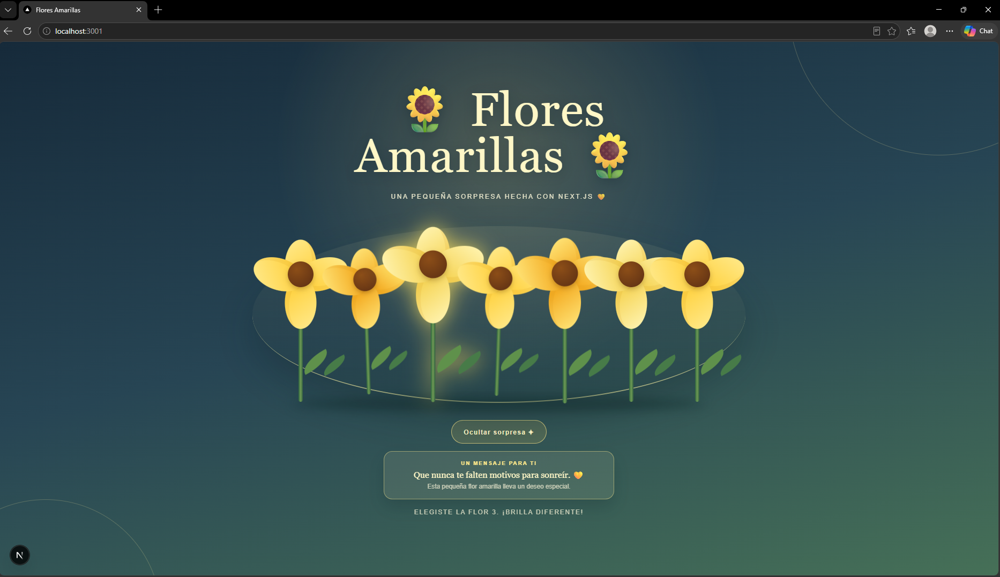

# Flores Amarillas

Una pequeña sorpresa interactiva creada con Next.js y React. La pantalla presenta un jardín de siete flores amarillas que el usuario puede seleccionar individualmente para resaltarlas. También incluye un botón para mostrar u ocultar un mensaje especial.

## Lo realizado

- Diseño visual inspirado en un jardín nocturno, con flores en tonos amarillo, dorado y crema.
- Animaciones de entrada, crecimiento, selección y estados de interacción.
- Mensaje sorpresa con actualización dinámica del contenido.
- Diseño adaptable para escritorio y dispositivos móviles.
- Soporte para reducir las animaciones cuando el usuario lo solicita desde su sistema.
- Textos y metadatos configurados en español.

## Tecnologías

- Next.js 16
- React 19
- TypeScript
- CSS

## Ejecutar el proyecto

Instala las dependencias y ejecuta el servidor de desarrollo:

```bash
npm install
npm run dev
```

Después, abre [http://localhost:3001](http://localhost:3001) en el navegador.

Si el puerto `3000` está ocupado, Next.js utilizará automáticamente otro puerto disponible, como `3001`.

Otros comandos disponibles:

```bash
npm run lint
npm run build
npm run start
```

## Capturas del proyecto

Sí: crea una carpeta llamada `capturas` dentro de `public` y guarda allí las dos imágenes del proyecto:

```text
public/
└── capturas/
	├── vista-principal.png
	└── mensaje-sorpresa.png
```

Puedes usar estos nombres para mantener la sección organizada:

- `vista-principal.png`
- `mensaje-sorpresa.png`




